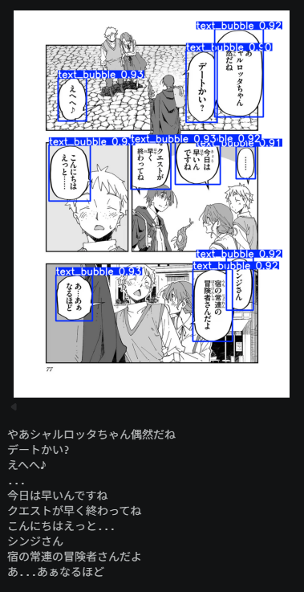
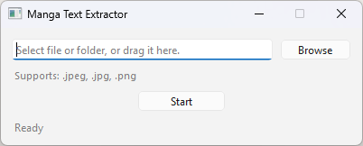

# Manga Text Extractor

An automated tool to recognize Japanese text within manga from an entire image files or folder and export the results to a text file.

## Data Sources

*   **Speech Bubble Detection:** Fine-tuned YOLOv8m model trained to detect speech bubbles across Manga, Webtoon, Manhua, and Western Comic style images.

    **Model Source:** [ogkalu/comic-speech-bubble-detector-yolov8m](https://huggingface.co/ogkalu/comic-speech-bubble-detector-yolov8m)

*   **Manga OCR:** Deep learning model to convert Japanese text images inside speech bubbles into digital text using the Vision Encoder Decoder framework.

    **Model Source:** [kha-white/manga-ocr-base](https://huggingface.co/kha-white/manga-ocr-base)


## Example



**[Demo Notebook & Live Output](sample.ipynb)**


## GUI App



If you just want to use the GUI app to extract text, simply install `uv` and execute the `run.bat` file.

To install `uv`, open PowerShell and run the following command:
```powershell
powershell -ExecutionPolicy ByPass -c "irm https://astral.sh/uv/install.ps1 | iex"